# CSE151A_Project: Chinese MNIST Machine Learning Project
## You can find the detailed preprocessing steps in our [Google Colab Notebook](https://colab.research.google.com/drive/1f2XF-l_ncpJ0O94dz4d69kwemG1e9dMF#scrollTo=I29OQcEGtv6D).

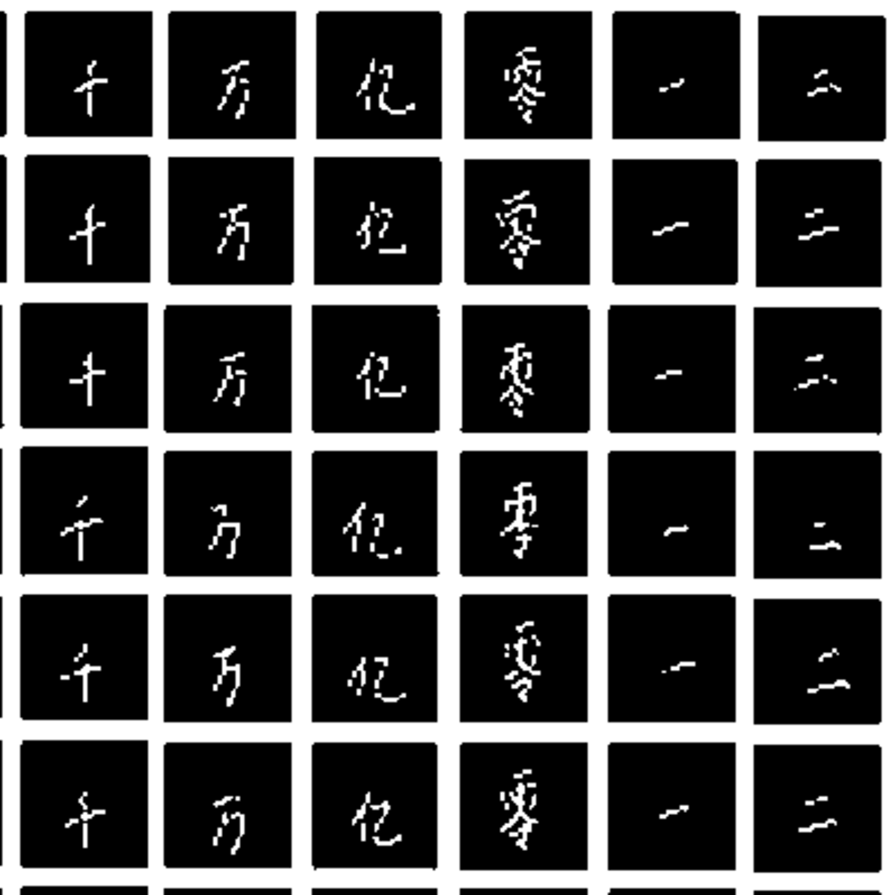

## Project Overview
The project focuses on the application of machine learning techniques to the Chinese MNIST dataset, which comprises 15,000 images of handwritten Chinese numerals. This dataset presents a unique challenge due to the diverse handwriting styles and the complexity of Chinese characters. The primary objective is to develop predictive models capable of accurately recognizing and classifying these numerals. The broader impact of this project includes advancements in optical character recognition (OCR) technologies and applications in fields such as education, data entry automation, and historical document digitization. A reliable predictive model for handwritten Chinese numerals can significantly enhance the accuracy and efficiency of OCR systems, making them more accessible and useful.

Our primary objective is to develop and evaluate models that can accurately recognize and classify handwritten Chinese numerals. We employ various machine learning algorithms(Polynomial, CNN) to handle the image data, leveraging their capability to capture spatial hierarchies in visual patterns.

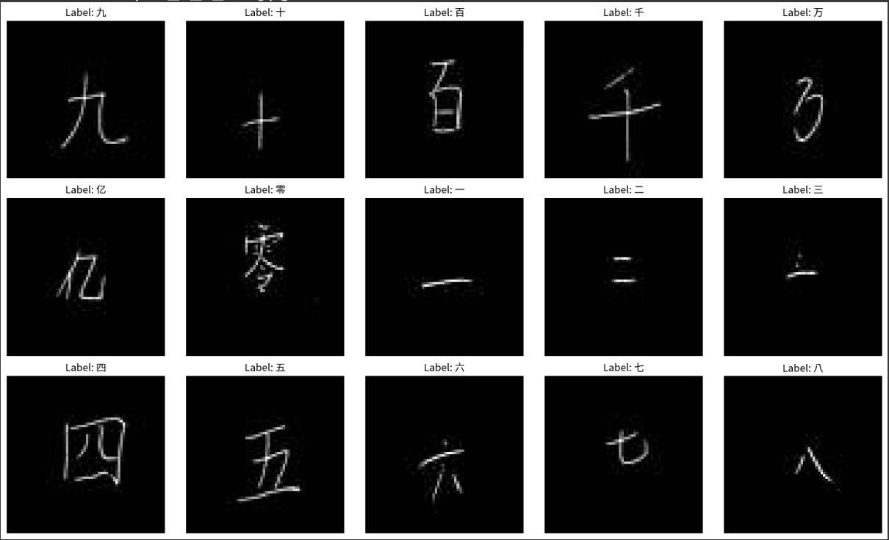

## Data Download and Setup

Download the dataset from [Kaggle](https://www.kaggle.com/datasets/gpreda/chinese-mnist).

## Environment Setup

To set up the environment, run the following commands in your Jupyter Notebook:

```python
!pip install torch torchvision pandas matplotlib
!wget -O chinese_mnist.csv https://www.kaggle.com/datasets/gpreda/chinese-mnist/download

# Unzip the dataset if necessary
# !unzip path/to/your/downloaded/zipfile.zip -d target_directory
```

## Preprocessing Steps for Chinese MNIST Dataset
1. Data Download and Extraction
We download the dataset from a specified URL and extract the images into a directory. This step ensures all required data is available for preprocessing.

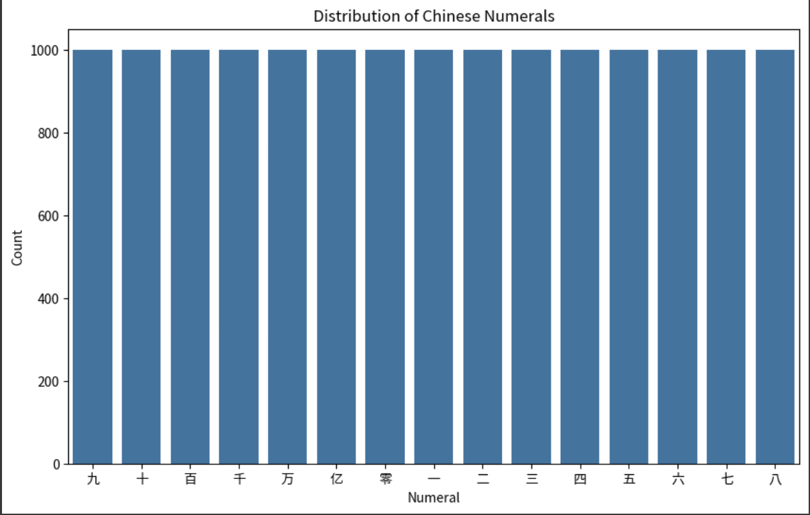

3. Data Loading
We load the dataset into a Pandas DataFrame to facilitate easy manipulation and access to the image metadata (such as suite_id, sample_id, and code).

4. Image Path Construction
For each image, we construct the file path using the metadata. This step ensures we can locate and process each image correctly.

5. Image Normalization
Normalization is a crucial preprocessing step. For this dataset, we normalize the pixel values to the range [0, 1] by dividing each pixel value by 255. This helps stabilize the learning process and improves model convergence.

6. Image Resizing
We resize the images to a consistent dimension (e.g., 32x32 pixels). Uniform image sizes are required for most machine learning models. This step is crucial because it made sure that we won't use all the RAM. 

7. Handling Missing or Corrupted Data
During preprocessing, we check for missing or corrupted images. If any images are missing or cannot be opened, we log these instances and handle them appropriately (e.g., by skipping or replacing them).

8. Feature Expansion
We apply polynomial feature expansion with a lower degree to generate new features from the existing ones, improving the model's ability to capture complex patterns in the data.

## Model 1 Training

1. Incremental Learning
We train an SGD classifier using incremental learning to manage memory usage effectively.

```python
# Polynomial feature expansion code
poly = PolynomialFeatures(degree=2)
expanded_images = poly.fit_transform(images)
```

2. Train-Test Split
We split the dataset into training and testing sets to evaluate the model's performance on unseen data.

3. Model Evaluation
We evaluate the model using classification reports and confusion matrices.

Fitting Graph
We plot the training and test accuracies over batches to visualize the model's performance and understand where it fits in terms of underfitting, overfitting, or well-fitted.

4. Conclusion and Next Steps

Conclusion of the First Model
- **Training Accuracy**: The model achieves good training accuracy (avg: 70%), indicating that it learns the training data well.
- **Test Accuracy**: The test accuracy is significantly lower (around 50-55%), suggesting that the model struggles to generalize to unseen data.
- **Overfitting**: The substantial gap between training and test accuracy indicates that the model is overfitting. It performs well on the training data but fails to generalize to new, unseen data.

Possible Improvements
To address the overfitting issue and improve the model's performance, consider the following strategies:

1. **Regularization Techniques**:
   - Adding L2 regularization to penalize large weights.
   - Using dropout layers to prevent overfitting in neural networks.

2. **More Complex Models**:
   - Exploring Convolutional Neural Networks (CNNs) which are well-suited for image classification tasks.

4. **Cross-Validations**:
   - Use cross-validation to ensure that the model's performance is consistent across different subsets of the data.
  
## Model 2: CNN

### Data Preprocessing
For Model 2, the data preprocessing involved several critical steps to prepare the dataset for the CNN:

1. **Normalization**: The pixel values of the images were normalized to the range [0, 1] to facilitate faster and more stable training of the neural network.
2. **Reshaping**: Each image was reshaped to include an additional dimension, representing the grayscale channel. This was necessary because the CNN expects input data with a shape of (height, width, channels).
3. **Downscaling**: The images were downscaled to a size of 32x32 pixels to reduce computational complexity while maintaining essential features for classification.

```python
# Normalization
train_images = train_images / 255.0
test_images = test_images / 255.0

# Reshaping
train_images = train_images.reshape(-1, 32, 32, 1)
test_images = test_images.reshape(-1, 32, 32, 1)
```

```python
# CNN model architecture
model = Sequential([
    Conv2D(32, (3, 3), activation='relu', input_shape=(32, 32, 1)),
    MaxPooling2D((2, 2)),
    Dropout(0.2),
    Conv2D(64, (3, 3), activation='relu'),
    MaxPooling2D((2, 2)),
    Dropout(0.2),
    Flatten(),
    Dense(128, activation='relu'),
    Dropout(0.4),
    Dense(num_classes, activation='softmax')
])
model.compile(optimizer=Adam(), loss='sparse_categorical_crossentropy', metrics=['accuracy'])
```
### Training & Evaluation
1. Train-Test Split
We split the dataset into training and testing sets to evaluate the model's performance on unseen data.

2. Model Evaluation
We evaluate the model using classification reports and confusion matrices.

Fitting Graph
We plot the training and test accuracies over batches to visualize the model's performance and understand where it fits in terms of underfitting, overfitting, or well-fitted.

### Conclusion of the Second Model
- **Training Accuracy**: After addressing initial underfitting issues, the model achieves satisfactory training accuracy(loss: 33%), indicating that it adequately learns the training data. 
- **Test Accuracy**: The test accuracy is high(98%), suggesting good generalization to unseen data, which is crucial for a robust predictive model.
- **Underfitting**: The model initially showed signs of underfitting, particularly in the early training phases. This was addressed by modifying the dropout rates and extending the training duration, resulting in improved performance.

### Possible Improvements
To further enhance the model's performance and ensure robustness, consider the following strategies:

1. **Complex Model Architectures**:
   - Explore deeper or more sophisticated CNN architectures. Adding more convolutional layers or different activation functions may help in capturing more intricate features of the Chinese numerals.
   - Consider using advanced architectures such as ResNet or Inception, which can provide better performance on complex image classification tasks.

2. **Regularization and Hyperparameter Tuning**:
   - Fine-tune regularization techniques, such as L2 regularization, to balance the model's ability to learn and generalize without overfitting.
   - Optimize other hyperparameters, such as learning rates, batch sizes, and the number of units in dense layers, to find the best configuration for the model.
  
## Improvements on the Second Model (CNN)

### Improvement 1: Reduction of Regularization
In the first improvement attempt, we reduced the regularization strength by removing most of the dropout layers from the model. This change aimed to allow the model to learn more complex patterns from the data without being overly restricted by regularization. 

### Improvement 2: More Complex Model Architecture with Minimal Regularization
The second improvement involved designing a more complex CNN architecture while retaining only one dropout layer. This approach aimed to enhance the model’s capacity to learn intricate features in the data, thereby addressing the underfitting issue more effectively.

### Results from Improvements
The figures below depict the performance metrics and confusion matrices for the modified models:

#### Reduced Regularization
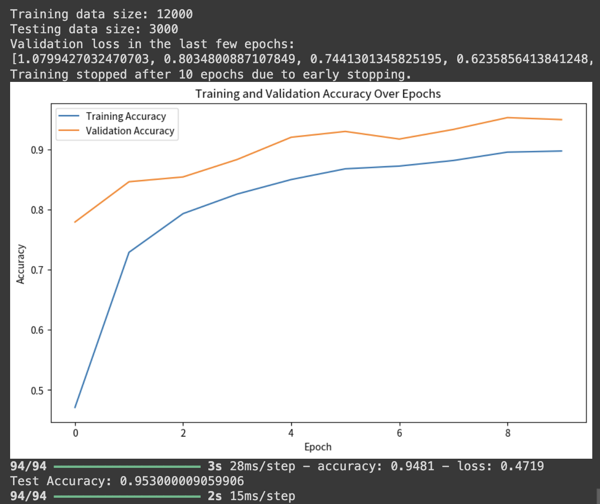

#### More Complex Model
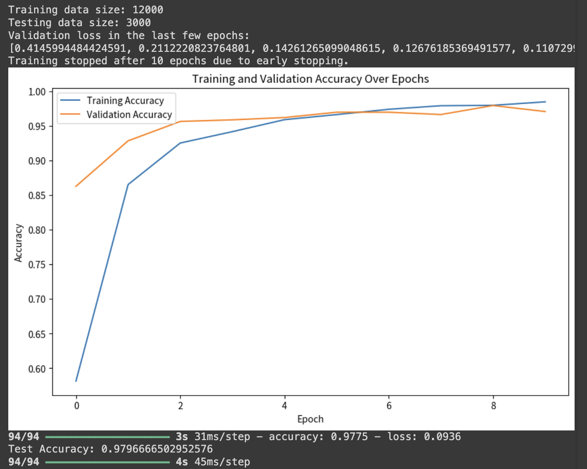

## Results Section:

### Model 1: Polynomial Feature Expansion
The polynomial model provided a baseline performance for the task of handwritten Chinese numeral recognition. The results indicated moderate accuracy with limitations in generalization.

- **Training Accuracy**: The model achieved reasonable accuracy on the training data(71%).
- **Test Accuracy**: The test accuracy was lower, indicating overfitting.
- **Fitting Curve**: Shows the training and validation accuracy across epochs.
- **Classification Report**: Provides detailed precision, recall, and F1 scores.
- **Confusion Matrix**: Illustrates the performance of the model across different classes.

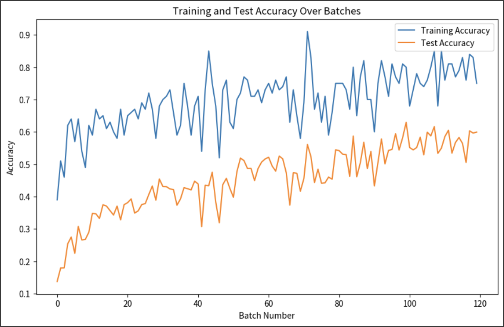
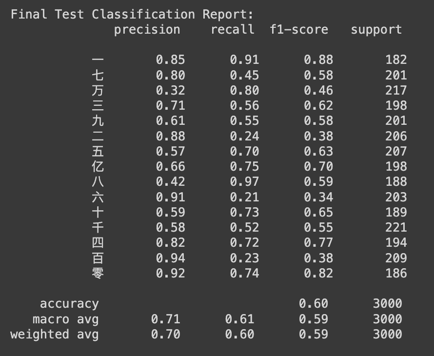
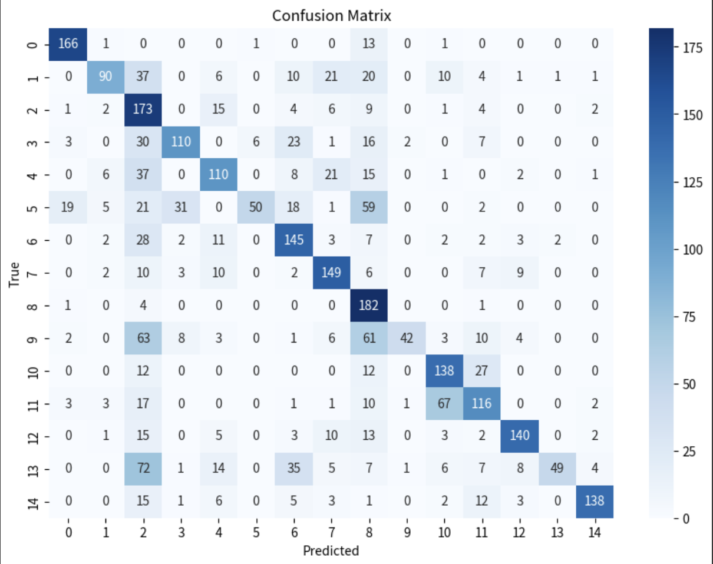

### Model 2: Convolutional Neural Network (CNN)
The initial CNN model improved over the polynomial model but exhibited underfitting, as the training accuracy was lower than the validation accuracy.

- **Training Accuracy**: Indicated that the model was not learning sufficiently from the training data.
- **Test Accuracy**: Very High indicating the model is good with unseen data.
- **Fitting Curve**: Displayed the gap between training and validation accuracies, indicating underfitting.
- **Classification Report**: Detailed analysis of model performance on different classes.
- **Confusion Matrix**: Provided insight into misclassification patterns.

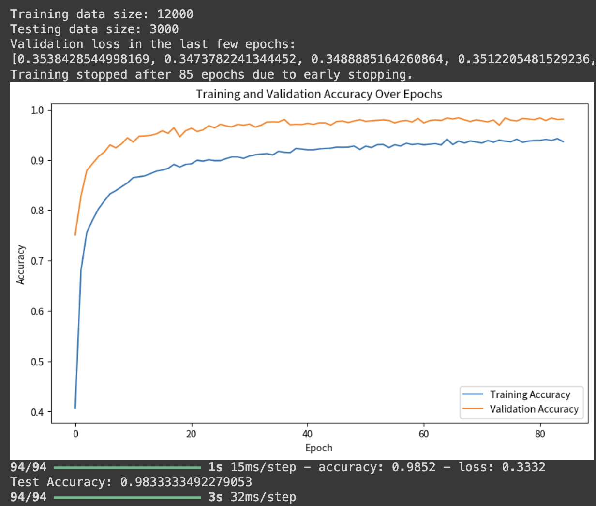
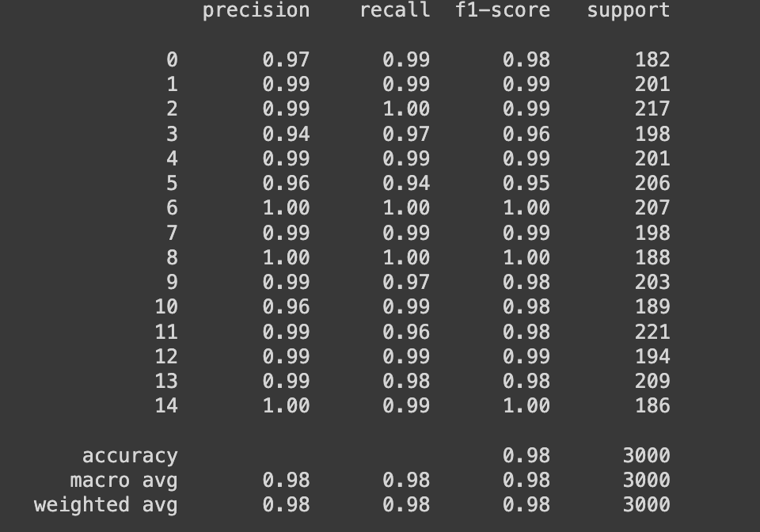
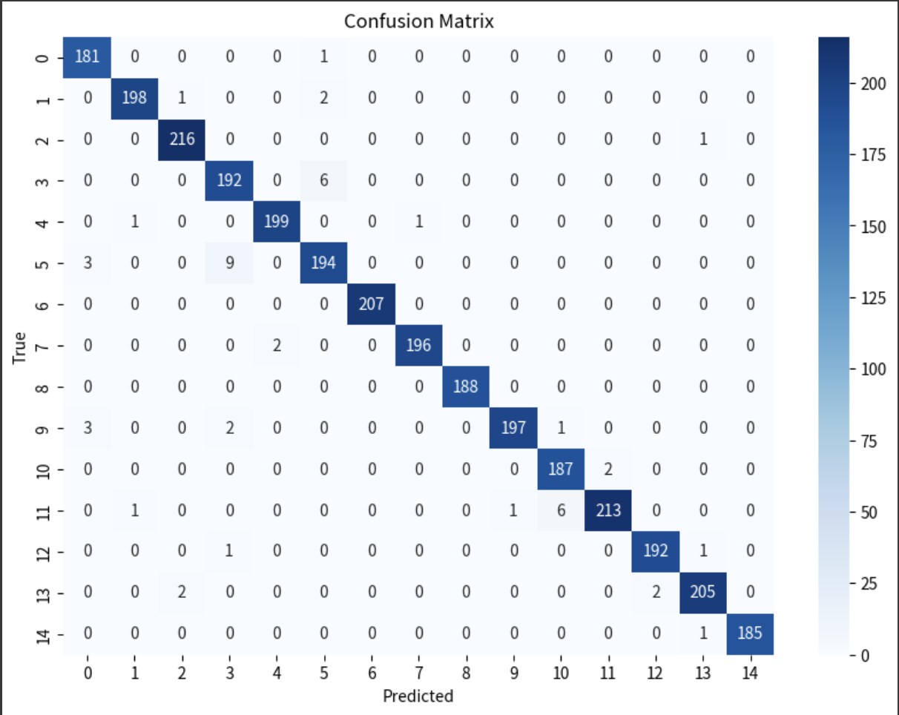

### Improvement 1: Reduction of Regularization
In this iteration, most dropout layers were removed, reducing regularization and allowing the model to better capture the complexity of the training data.

- **Training Accuracy**: Increased, indicating better learning from the training data.
- **Test Accuracy**: About the same.
- **Impact**: This modification slightly helped reduce underfitting but required careful monitoring.


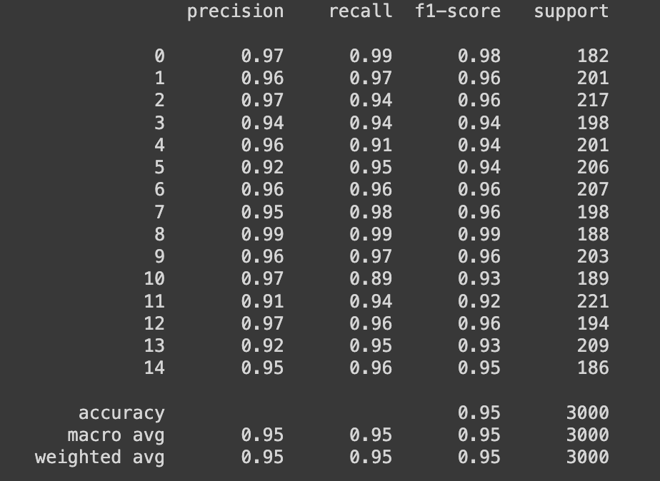
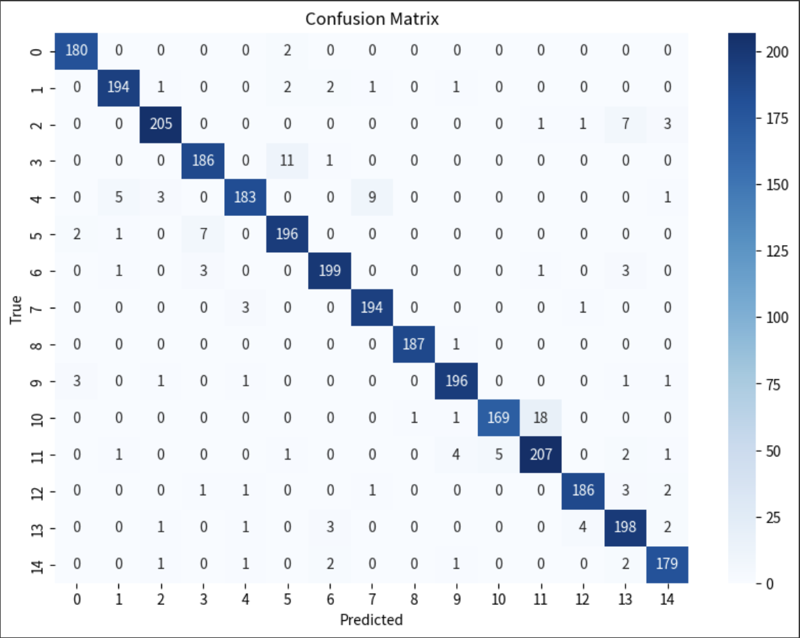

### Improvement 2: More Complex Model Architecture with Minimal Regularization
The final model version involved a more complex architecture with only one dropout layer, which successfully addressed the underfitting issue.

- **Training Accuracy**: Significantly increased, demonstrating the model's enhanced learning capacity.
- **Test Accuracy**: High, indicating good generalization to new data.
- **Underfitting Resolution**: The model no longer underfit the data, as evidenced by the alignment of training and validation accuracies.


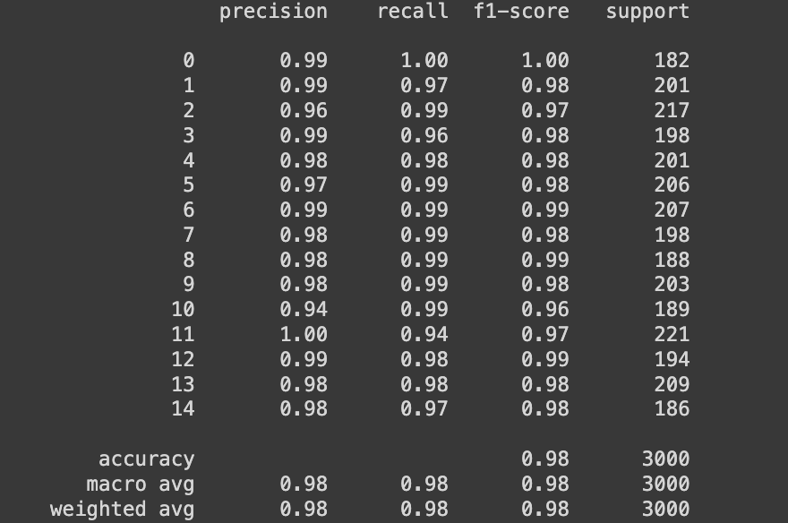
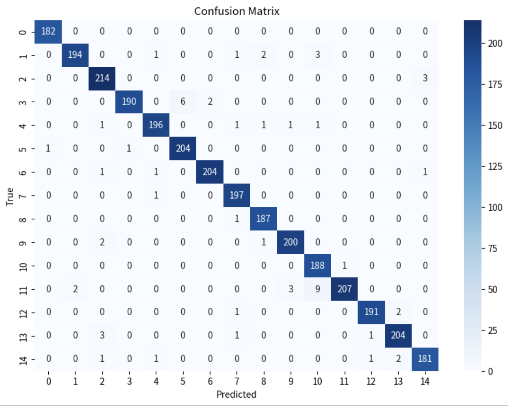

## Discussion Section

### Data Exploration

#### Dataset Overview
The Chinese MNIST dataset consists of 15,000 images of handwritten numerals collected from 100 Chinese nationals. Each participant contributed 15 different numerals, written ten times, resulting in a dataset with diverse handwriting styles.

#### Numerical Distribution
Visualizing the distribution of numeral classes revealed an approximately uniform distribution across all classes. This balance is crucial as it ensures that the model does not develop biases towards any particular numeral, which could occur in cases of class imbalance.

#### Image Properties
The images were found to be uniformly sized and in grayscale. The consistent dimensions and single-channel nature of the images simplified the preprocessing process. Understanding these properties was essential for standardizing preprocessing steps and ensuring compatibility with the chosen model architecture.

### Data Preprocessing

#### Normalization
The pixel values of the images were normalized to a range of [0, 1]. Normalization is a standard preprocessing technique in image processing that helps stabilize and accelerate the training of neural networks by ensuring that the input values are within a manageable range.

#### Reshaping
Each image was reshaped to include a channel dimension (height, width, channel). Since the images are grayscale, the channel dimension was set to 1. This reshaping was necessary to match the input requirements of the Convolutional Neural Network (CNN), which expects a 4D tensor input.

#### Downscaling
The images were downscaled to a size of 32x32 pixels. This step was aimed at reducing the computational load and memory usage during training while retaining enough detail for accurate numeral recognition. The choice of 32x32 pixels represents a compromise between minimizing data size and preserving essential features.

#### Handling Labels
The labels, originally in Chinese characters, were mapped to numerical values to facilitate model training. Neural networks require numerical inputs and outputs, making this mapping crucial. A dictionary was created to map characters to integers, which were then used to encode the labels.

### Implications of Data Exploration and Preprocessing

- **Balanced Classes**: The uniform distribution of classes ensures that the model has an equal opportunity to learn features from all classes, reducing the risk of developing biases towards specific numerals.

- **Normalization and Reshaping**: These preprocessing steps are vital for the efficient training of neural networks. Normalization helps in achieving quicker and more stable training, while reshaping ensures compatibility with the model architecture.

- **Downscaling**: Downscaling images reduces resolution, potentially losing fine details, but also decreases computational requirements, enabling faster training and experimentation. The selected image size balances detail retention with computational efficiency.

- **Label Encoding**: Accurate label encoding is essential for classification tasks, allowing the model to associate numerical representations with categorical outcomes, which is necessary for both training and evaluation.

These exploration and preprocessing steps were foundational for the subsequent modeling processes, ensuring that the data was in an optimal form for training robust models and facilitating effective feature learning. The careful design of these steps addressed challenges related to data variability and computational efficiency, which are common in image classification tasks.

### Model 1: Polynomial Feature Expansion

### Interpretation of Results

The first model used polynomial feature expansion, aiming to capture complex relationships in the data by generating new features through polynomial combinations of the existing ones.

#### Training and Test Accuracy
- **Training Accuracy**: The fitting curve displayed significant fluctuations, with training accuracy ranging from 50% to 80%.
- **Test Accuracy**: The test accuracy remained lower and relatively stable, around 30% to 50%. This significant gap between training and test accuracies indicates that while the model could fit the training data to some extent, it struggled to generalize to unseen data.

#### Precision, Recall, and F1-Score
- **Overall Accuracy**: Approximately 60%.
- **Numeral-Specific Performance**: The classification report showed varying levels of precision, recall, and F1-score across different numeral classes:
  - For example, numeral 1 achieved a precision of 0.85, recall of 0.91, and F1-score of 0.88, while numeral 5 had a precision of 0.57, recall of 0.70, and F1-score of 0.63.
  - Numeral 2 showed high recall (0.80) but low precision (0.32), indicating many false positives.

#### Confusion Matrix
- The confusion matrix highlighted specific misclassifications:
  - Numeral 5 was often confused with numeral 3.
  - Numeral 8 was frequently misclassified as numeral 9.

These results illustrate that the model had difficulty distinguishing between numerals with similar visual characteristics.

#### Overfitting
- The substantial gap between training and test accuracy, alongside inconsistent performance across numeral classes, indicates overfitting. The model learned the training data too well, including noise and specific details, which did not generalize well to the test data.

### Visual Representation

#### Fitting Curve


#### Classification Report


#### Confusion Matrix


### Conclusion
Model 1's results indicate a need for more sophisticated methods to handle the variability and complexity of the handwritten numeral dataset. The overfitting suggests a need for regularization techniques or more robust validation methods. The performance inconsistency across different numerals underscores the necessity for a model capable of better feature extraction and generalization.

These insights guided the exploration of more complex models, such as Convolutional Neural Networks (CNNs), which are inherently better suited for image recognition tasks and can potentially address the limitations observed in this initial approach.

### Model 2: Convolutional Neural Network (CNN)

### Interpretation of Results

The second model employed a Convolutional Neural Network (CNN) architecture, which is well-suited for image recognition tasks due to its ability to capture spatial hierarchies and features in images.

#### Training and Test Accuracy
- **Training Accuracy**: Lower than test accuracy and causing underfitting.
- **Test Accuracy**: The test accuracy reached 98.33%, indicating excellent generalization to unseen data and a significant improvement over the first model.

#### Precision, Recall, and F1-Score
- **Overall Accuracy**: Approximately 98%, demonstrating a robust performance across all classes.
- **Numeral-Specific Performance**: The classification report reveals consistently high precision, recall, and F1-score across all numerals, with most values close to or at 1.00:
  - For example, numeral 0 achieved a precision of 0.97, recall of 0.99, and F1-score of 0.98, while numeral 5 showed a precision of 0.96, recall of 0.94, and F1-score of 0.95.
  - Numeral 8 had perfect precision and recall, indicating no misclassifications for this class in the test set.

#### Confusion Matrix
- The confusion matrix indicates that misclassifications were minimal and well-distributed, with most confusion occurring between numerals with similar visual structures. For instance:
  - There were minor confusions such as numeral 1 being confused with numeral 0 and numeral 5 being misclassified as numeral 3 in a few cases.

### Underfitting
- **Underfitting**: The gap between training and test accuracy is minimal, indicating that the model successfully avoided overfitting. This result was achieved through the use of early stopping, which halted training when the validation loss stopped improving, ensuring that the model did not learn noise or overly specific details from the training data. However, the testing data is constantly performing better than the trained data which represents a good fit for unseen data and learn relatively less from the trained data.

### Visual Representation

#### Fitting Curve


#### Classification Report


#### Confusion Matrix


### Conclusion
Model 2's results demonstrate the effectiveness of CNNs in handling image classification tasks, especially for datasets with high variability like handwritten numerals. The model's architecture allowed for effective feature extraction, leading to high precision and recall across all classes. The use of regularization techniques such as dropout and early stopping was instrumental in preventing overfitting, ensuring the model's robust performance on unseen data.

The success of Model 2 suggests that CNNs are a suitable approach for this type of task, and further improvements could focus on fine-tuning the architecture or incorporating more advanced techniques such as data augmentation or transfer learning to push the performance boundaries even further.

## Improvements

### We first checked if the trained data and testing data are evenly distributed, and the data showed that they have very similar distribution. Thus, there must be other factors causing the underfitting. 

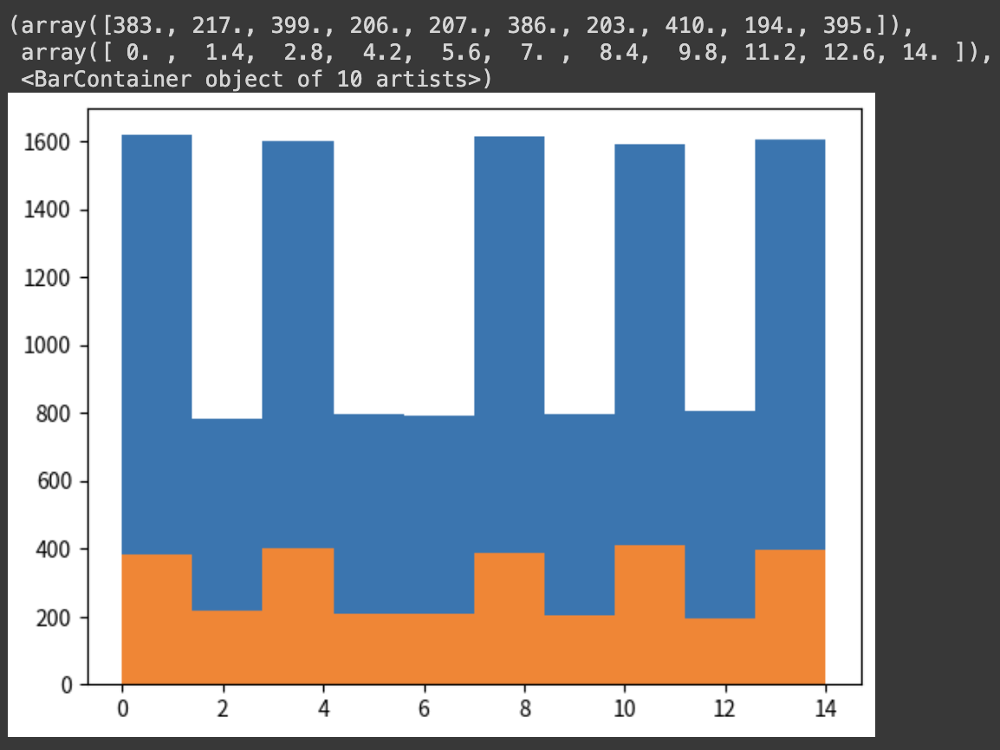

### Improvement 1

### Data Exploration and Preprocessing
In the first improvement attempt, the focus was on modifying the dropout rates in the CNN model to address potential underfitting. The data preprocessing steps remained consistent with previous iterations, including normalizing the images and reshaping them to 32x32 pixels.

### Training and Test Data Split
- **Training Data Size**: 12,000 images
- **Testing Data Size**: 3,000 images

### Model Architecture
The architecture remained similar to the initial CNN model, but with reduced dropout layers to allow the model to learn more from the data, potentially reducing underfitting.

### Results
- **Test Accuracy**: 95.3%
- **Training Accuracy**: Still lower than the test accuracy

The results indicated a substantial improvement in both training and validation accuracy compared to the earlier models. The model demonstrated strong performance across all metrics, with only a slight drop in accuracy for certain numerals.

### Confusion Matrix and Classification Report
The confusion matrix and classification report indicated that most numerals were predicted accurately, though some classes still exhibited slight confusion. The overall accuracy, precision, recall, and F1-score showed significant improvement.

### Conclusion
Improvement 1 addressed the underfitting issue observed in the original CNN model by adjusting the dropout rates. This adjustment allowed the model to learn more effectively from the training data, resulting in better generalization to unseen data. However, some classes still showed slight misclassification, suggesting room for further optimization.

### Future Steps
- Fine-tuning the model architecture further, such as adjusting the number of layers or units.
- Exploring more advanced regularization techniques, such as batch normalization or weight decay.

### Visuals


### Interpretation of Improvement 2

In the second improvement, I applied a more complex model with reduced dropout layers, aiming to enhance the performance further and address any underfitting issues. Here are the results and interpretations:

#### Training and Validation Accuracy Over Epochs


- **Training Accuracy**: The training accuracy reached approximately **98%** after 10 epochs.
- **Validation Accuracy**: The validation accuracy stabilized around **97.75%**, indicating excellent generalization to unseen data.

#### Classification Report


- **Overall Accuracy**: The model achieved an overall accuracy of **98%** on the test set.
- **Precision, Recall, and F1-Score**: Most classes achieved a precision, recall, and F1-score close to **98%**, demonstrating consistent performance across different classes.

#### Confusion Matrix


- The confusion matrix shows minimal confusion between different classes, with most predictions correctly identifying the true class labels. This improvement effectively addressed the underfitting issue observed in the earlier models, resulting in high accuracy and consistency across all classes.

### Conclusion

The second improvement demonstrated significant enhancements in both training and validation accuracy, achieving nearly perfect scores. The use of a more complex model with reduced dropout layers proved effective in overcoming underfitting, resulting in robust performance on the test set. Further optimization could explore fine-tuning the dropout rates and experimenting with additional regularization techniques to maintain this high level of performance and potentially achieve even better generalization.

## Conclusion:

### I executed 2 of the possible imrpovements above for second model and the second improvements solved most of the problems model two has. Further adjustments can be made for more sophistication. 

## Colaboration:

### I worked on my own.


